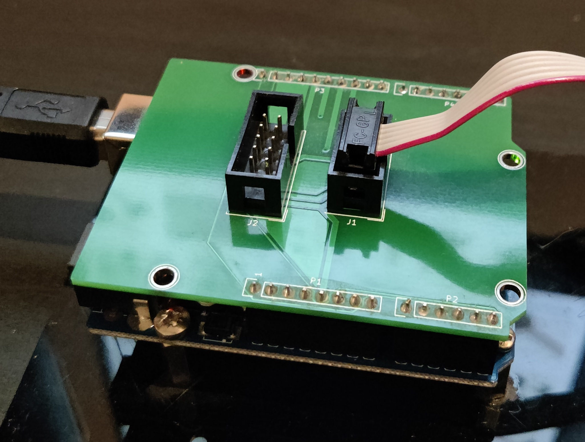
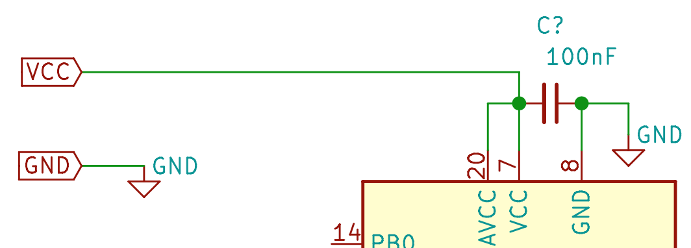
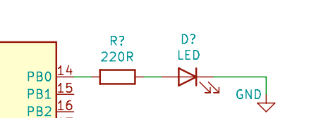
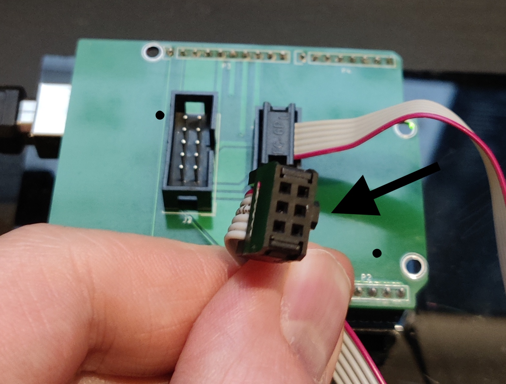
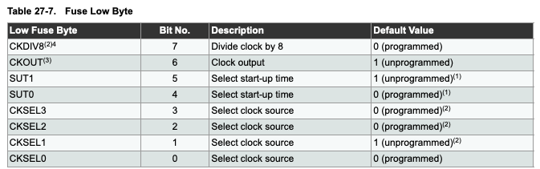
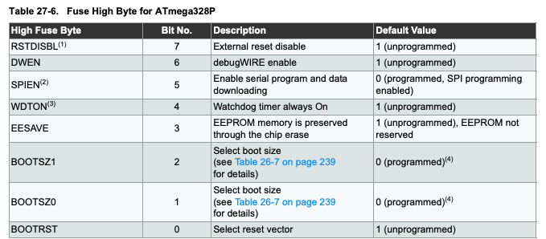
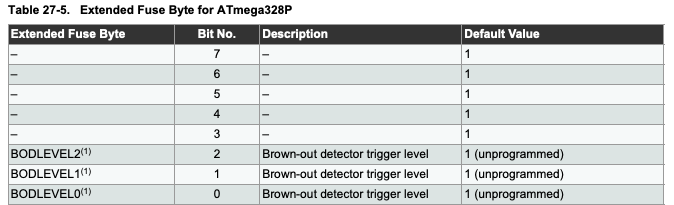

# Getting Started with Blink

The projects outlined in this repository are intended for ["bare metal"][Bare_Metal_URL] AVR programming. That is - compiling, debugging and flashing your application without an underlying operating system, directly to the target MCU using the AVR toolchain and an ISP programmer, rather than using the simpler and more user-friendly (but somewhat limiting) Arduino framework.

The Blink example isn't a particularly groundbreaking project, but it serves to verify that the setup of your development environment and configuration of the target MCU have been performed correctly, before moving onto more complex projects and examples where issues could be harder to diagnose. 

# Software Requirements

## A Source Code Editor
I like [Sublime Text][Sublime_Text_URL], but there are plenty to choose from, some popular choices are:
- [Sublime Text][Sublime_Text_URL]
- [Visual Studio Code][VS_Code_URL]
- [Codespaces][Codespaces_URL]
- [Atom][Atom_URL]

## The AVR Toolchain
### MacOS
[AVR CrossPack][AVR_Crosspack_URL] will provide everything you need to develop for AVR on MacOS; the GNU compile suite, C libraries for the AVR, the AVRDUDE uploader and more.
### Linux
#### Debian/Ubuntu distributions
- It's helpful to update all your current installed packages first.

	`sudo apt-get update`

	`sudo apt-get upgrade all`

- Then we can install the required packages.

	`sudo apt-get install avrdude avrdude-doc gcc-avr binutils-avr avr-libc gdb-avr`

#### Red Hat and Fedora distributions
- It's helpful to update all your current installed packages first.

	`sudo yum update`

	`sudo yum upgrade-all`

- Then we can install the required packages.

	`sudo yum install avrdude avr-gcc avr-binutils avr-libc avr-gdb`

### Windows
Windows users can use the official toolchain from the manufacturer, [Microchip Studio][Microchip_Studio_URL] (formerly ATmel). This is an IDE so it's full of features, but also has a relatively steep learning curve - follow their tutorial [here][Microchip_Studio_Tutorial_URL] to get to grips with it.

## A Serial Terminal Program
This is used later in the more advanced modules to send messages between your PC and the target MCU. You'll find it's a vital debugging tool when coupled with the log_system module. I tend to use [CoolTerm][CoolTerm_URL] which is available for free on MacOS, Windows and Linux.

# Hardware Required

## An AVR microcontroller
An [ATmega328P-PU][ATmega328_URL] is a good place to start - It's a DIP package so fits nicely in a breadboard or an IC socket, has a whopping 32KB of flash memory (ok it's not much but you can do a surprising amount with that), and 3 GPIO ports. This chip is ubiquitous so you'll have no problem finding hardware to support it - it's actually the MCU the Arduino Uno is built around.

It's worth noting that the ATmega328P now has a status of "Not recommended for new designs" meaning the model is being gradually phased out in favour of the newer ATmega328PB. Code written for the 328P will still work fine on the 328PB thanks to backwards compatability, but it is **not** a drop-in replacement, so the pinout will be different. For more info on the differences betwenn the two, see application note [AT15007][AT15007_URL]. Most of the examples in this repository will be using the ATmega328P, and it is strongly advised to refer to it's [datasheet][ATmega328p_Datasheet_URL] if you are unsure about anything along the way.

Whilst the [datasheet][ATmega328p_Datasheet_URL] may be overwhelming at first, it's best to get used to referring to it as you go. It's also worth pointing out at this stage that you aren't expected to read it cover to cover as if it were a novel. Use the index menu in your PDF browser to home in on the chapter or section that sounds like it might be most relevant to the register or peripheral you're working on.

## An ISP Programmer
Such as an [AVRISP MKII][AVRISP_URL], however that model is not compattible with MacOS, so instead I use an Arduino Uno with the "Arduino as ISP" sketch flashed to it, and [a simple shield I made][Uno_ISP_Shield_URL] - though you can achieve the same thing with some dupont cables if you don't want to wait for the shield to come back from fab. The Arduino as ISP sketch can be found in the Arduino IDE.

## A USB to Serial Converter
There are many types available, I use one of [these][USB_Serial_URL].

## Various USB cables
It's useful to keep several USB cables, micro, mini, USB-A etc.

## Breadboards
I like [these][Small_Breadboard_URL] ones with the power supply module for small test projects, and [these][Large_Breadboard_URL] ones for larger, more complex projects. For anything beyond that, I would design a development PCB with lots of connection and expansion flexibility.

## Power Supply (optional)
Most ISP programmers will provide a 5V power line for your MCU, however this is likely sourced from your PC's USB port, and there are a few things to be aware of here. First, most USB ports can only source upto 500mA, so if your project is likely to come close to or surpass that limit, you wil need to provide an external power supply capable of sourcing that much current. Also note the GPIO's on the AVR aren't able to source (or sink) much current, 40mA is the upper limit, so further driver circuitry will be needed to drive larger loads.

## Jumpers/Dupont cables
A set of [breadboard jumper cables][Breadboard_Jumpers_URL] is handy to keep your close wiring neat and tidy, then a set of various lengths and connection types of [dupont cables][Dupont_Cables_URL] is useful to connect to other peripherals.

## An assortment of components
A kit like [this one][Components_Kit_URL] is a frugal way to source many of the components and accessories needed. You will certainly need a selection of resistors, capacitors, LEDs etc. 

## A multimeter
A multimeter like [this one][Multimeter_URL] will help with debugging when hardware is involved. An [oscilloscope][Oscilloscope_URL] gives an extra dimension of insight into your circuits and applications, but they are an expensive piece of kit so a little out of reach for beginners.

# Connecting the Hardware

The following setup guide is for an ATmega328p, so if you're starting with a different model it's best to refer to your part's datasheet for pinout, auxillary components needed, power requirements etc, but the broad principles should be much the same.

## MCU Connections
Note the 100nF ceramic capacitor between VCC and GND, this is for decoupling and filtering of the power supply, so should be placed as close to the pins as possible.

You can use the MCU with just it's internal oscillator as a clock source, or if you'd prefer a faster clock speed you can use an external crystal oscillator. Refer to your chip's datasheet for the correct oscillator circuit design. 

Connect a GPIO pin (PB0 in this example) to an LED, with a 220Ω resistor in series with the anode, and the cathode to ground.

## Programmer Connections

The IDC connector on your ISP programmer should be connected to the target MCU as shown by the colour codes in the image below. These symbols depict the end of the IDC connector - Note the notch on the right hand side - if you turn the connector to face you and rotate it so the notch is on the right, your orientation will be correct.

If you're using an Arduino Uno as an ISP with some dupont cables, then you can make the connections as per the schematic below.

Connect the programmer to your PC, then check which serial port it's on. If you have the Arduino IDE, you can go to Tools > Port > *port address is shown here*.

For MacOS and Linux, open Terminal and type `ls /dev/tty*` for a list of connected devices. The programmer will look something like `/dev/tty.usbmodem14101`. 

For Windows, it will look something like COM3.

In Terminal/cmd, type `avrdude` to check the AVRDUDE software has been correctly installed. It should give you a helpful list of flags and arguments you can use. 

Now we can check the programmer and target MCU are connected and being recognised correctly by typing:
`avrdude -p m328p -c arvisp`, replace `m328p` with your MCU type, and `avrisp` with your programmer type if different from these. 

You should then see a success message. If not, check your wiring and connectiuons, check the target MCU is powered, and check the programmer type and AVR chip type are correct.

# Configuring the Makefile

Download the [source](./source) folder in this repository and open up the Makefile. The following variables need to be edited for your setup.

## MCU, Programmer and Directory variables

### MCU

This is the AVR chip type, a list of valid names can be found [here][AVR_GCC_Options_URL].

### F_CPU

This is the clock speed in Hz - Note the UL assignment (Unsigned Long). For the examples covered in this repo we will be using the 8MHz internal oscillator as a clock source for simplicity, though you can use an external clock source upto 20MHz if you'd prefer. By default, the AVR fuses will be set to divide the internal clock speed by 8, but we will override that with some Makefile settings. 

### BAUD

This is the baud rate used for serial comms with the AVR, usually 9600 but sometimes differs.

### LIBDIR

A directory for common include files, some of which are installed with the AVR toolchain. 

### PROGRAMMER_TYPE

The type of ISP programmer you're using. A list of valid names can be found [here][AVR_GCC_Options_URL].

### PROGRAMMER_ARGS

Extra arguments to avrdude: baud rate, chip type, -F flag, etc. The baud rate is for serial comms to the programmer. The port address also goes here. 

## Fuses

**WARNING**
Take great care when editing these variables, they can brick the MCU if set incorrectly. Always refer to the [datasheet][ATmega328p_Datasheet_URL] if unsure, especially if you are using a different MCU to the ATmega328p. And note that they use an inverse logic - the bit will read 1 if unprogrammed, and 0 if programmed. A handy fuse setting calculator can be found [here][Fuse_Calculator_URL].

### LFUSE
Low fuse byte. This is used to select the clock source and some config settings for clock operation.

### HFUSE
High fuse byte. Bits 2 - 0 are used to select the amount of memory allocated for a bootloader (not required for the projects in this repo). The remaining bits are used to control EEPROM, watchdog timer, programming and reset options. SPIEN and RSTDISBL are the dangerous ones likely to brick your MCU if set incorrectly, so **only** touch these if you know what you're doing. 

### EFUSE
Extended fuse byte. This is used to set the brownout detection level.

# Flashing the Chip
With the Makefile correctly configured, you are now ready to start writing data to the chip. Open Terminal and navigate to the directory where you stored the local copy of the [source][./source] folder you downloaded.

## Flash Fuses
First we need to flash the fuse settings. To do this, type `make fuses` and the values from your Makefile will be written to the chip. You only need to do this when a chip is new, in an unknown state (eg. when re-used from a previous project) or you want to change the fuse settings. These new settings will be "burned" into the register and remain the same even after the chip is powered down. 

## Flash the Code
Now we are finally ready to flash the code. Type `make flash`, and the source code will be compiled, linked and written to the MCU. 

### Basic Make Commands:
- `make` to compile the source code based on the settings in your Makefile.
- `make flash` to compile and flash the code to the target MCU.
- `make clean` to delete the compiled output files from the current directory.
- `make fuses` to write new fuse values.

These can of course be combined like so: `make clean flash fuses`.

### Advanced Make Commands:

If you'd like to learn more about the GNU Make Utility, more information can be found [here](https://www.gnu.org/software/make/). I found it to be a steep learning curve, so if you'd rather not wade into it just yet there are plenty of Makefile generators around. The Makefile used in these projects was adapted from the code provided with the book Make: AVR Programming by Elliot Williams. His repo, [hexagon5un/AVR-Programming](https://github.com/hexagon5un/AVR-Programming) has some great example projects, and I would thoroughly recommend the book to anyone looking to get into AVR Programming. 

## Verify Makefile Settings
You should now have an LED which blinks on and off in a 2 second cycle - 1 second on, followed by 1 second off. If it is blinking considerably faster or slower than this, check that the value of F_CPU and LFUSE are set correctly. 

Once you are satisfied that the LED is blinking as it should be, you're ready to proceed to the more exciting projects and examples in this repo!

## Style Guide
For a comprehensive guide on layout, style and documentation, see the [Anatomy of Embedded Firmware page][Firmware_Anatomy_URL].

## Documentation
To get a feel for the file structure, layout and formatting of embedded C firmware for AVR, check out the [documentation for the Blink example application.](/C-Programming-Resources-for-AVR-MCU-s/getting-started/files.html)

## Coding Standards
Adhering to coding standards helps to make your code more readable, robust, easier to debug and more portable. The firmware in this repo was written to the [Barr Group C Coding Standard][Barr_Coding_Standard_URL], and I would encourage others to read it and use those guidelines in their own code.

[Bare_Metal_URL]: https://microcontrollerslab.com/difference-bare-metal-and-rtos-based-embedded-systems/
[Sublime_Text_URL]: http://www.sublimetext.com/
[VS_Code_URL]: https://code.visualstudio.com/
[Codespaces_URL]: https://github.com/features/codespaces
[Atom_URL]: https://github.com/features/codespaces

[AVR_Crosspack_URL]: https://www.obdev.at/products/crosspack/index.html
[Microchip_Studio_URL]: https://www.microchip.com/en-us/tools-resources/develop/microchip-studio
[Microchip_Studio_Tutorial_URL]: https://www.microchip.com/en-us/tools-resources/develop/microchip-studio#Getting%20Started
[CoolTerm_URL]: https://freeware.the-meiers.org/
[AVRISP_URL]: https://www.amazon.co.uk/Waveshare-Programmer-USB-AVRISP-XPII/dp/B00KM6ZA9I?th=1
[Uno_ISP_Shield_URL]: ./Uno_ISP_Shield
[USB_Serial_URL]: https://www.amazon.co.uk/Ccylez-Converter-Adapter-FT232RL-Android-default/dp/B08DV1SXMQ/ref=sr_1_4?crid=8ZN3WET67TSU&keywords=usb+serial+converter+module&qid=1647296288&sprefix=usb+serial+converter+modul%2Caps%2C72&sr=8-4
[Small_Breadboard_URL]: https://www.amazon.co.uk/AZDelivery-Breadboard-Supply-Adapter-Jumkper/dp/B01N4VCYUK/ref=sr_1_20?crid=29EM44FS19IF2&keywords=breadboard%2Bwith%2Bpower%2Bsupply&qid=1647296608&sprefix=breadboard%2Bwith%2Bpower%2Bsupply%2Caps%2C64&sr=8-20&th=1
[Large_Breadboard_URL]: https://www.amazon.co.uk/K-H-RH-74-Solderless-Breadboard/dp/B079H4N8Y4/ref=sr_1_6?crid=18JXJAV0E8H6K&keywords=large+breadboard+electronics&qid=1647296861&sprefix=large+breadboard+electronics%2Caps%2C56&sr=8-6
[ATmega328_URL]: https://www.amazon.co.uk/Atmel-ATMega328-PU-ATMEL-Microcontroller-Chip/dp/B071Y4YF5X/ref=sr_1_5?crid=564N7F4OE3JE&keywords=atmega328&qid=1647299808&sprefix=atmega328%2Caps%2C62&sr=8-5
[ATmega328p_Datasheet_URL]: https://ww1.microchip.com/downloads/en/DeviceDoc/Atmel-7810-Automotive-Microcontrollers-ATmega328P_Datasheet.pdf
[AT15007_URL]: http://atmel-studio-doc.s3-website-us-east-1.amazonaws.com/webhelp/GUID-CBDC1838-0100-4F26-A45A-134958193C3B-en-US-3/index.html?GUID-2A0D6256-07A2-49A1-B57E-B94459515300
[Breadboard_Jumpers_URL]: https://www.amazon.co.uk/WANTOUTH-Preformed-Breadboard-Solderless-Prototyping/dp/B08QS6961R/ref=sr_1_5?crid=36KPWIVO59605&keywords=breadboard+jumpers&qid=1647300367&sprefix=breadboard+jumpers%2Caps%2C245&sr=8-5
[Dupont_Cables_URL]: https://www.amazon.co.uk/YXPCARS-Solderless-Breadboard-Multicolored-Arduino/dp/B08HQ7K6M7/ref=sr_1_27?crid=1GQC7DDTANB5H&keywords=dupont+cables+set&qid=1647301269&sprefix=dupont+cables+set%2Caps%2C71&sr=8-27
[Components_Kit_URL]: https://www.amazon.co.uk/Freenove-Ultimate-Compatible-Programming-Electronics/dp/B08B4D5MV5/ref=sr_1_17_sspa?crid=YI7I2MN0COCC&keywords=arduino+components+kit&qid=1647301388&sprefix=arduino+components%2Caps%2C75&sr=8-17-spons&psc=1&spLa=ZW5jcnlwdGVkUXVhbGlmaWVyPUEzTjY0QVFGTEZHREVNJmVuY3J5cHRlZElkPUEwNjU1Mzk4MkRCS1c5UFBaMUI2QiZlbmNyeXB0ZWRBZElkPUEwMDEyMzQxM1NSUDZWS1RPM1Q2SCZ3aWRnZXROYW1lPXNwX210ZiZhY3Rpb249Y2xpY2tSZWRpcmVjdCZkb05vdExvZ0NsaWNrPXRydWU=
[MULTIMETER_URL]: https://www.ebay.co.uk/itm/373974464011?epid=23040427421&_trkparms=ispr%3D1&hash=item57129d760b:g:ecgAAOSwcvJhM~1Y&amdata=enc%3AAQAGAAACoPYe5NmHp%252B2JMhMi7yxGiTJkPrKr5t53CooMSQt2orsSafTQYbq3L7RBVAMi0K9cw1RWXBpCryIDtHtQ%252FwGGrM5qNRo2BcdEvJNXURbFcGIieFzIjcYyayBhlA94swn2TTvs028l2IF1Z7kkPlAkTOZau7i64BOsAJM5jtEUKTzYuTAksI%252B6wqVDHXCmc%252BbqVJWdWCtN%252FedfWrLz22fV7JfFf3r%252BndQy6pgUf%252B0CqyxVpLGK%252FtsA2WoJN66265Nsb%252Biz2cPGbaMohOx96MSBAMI556eVyZ1Jt%252FgLkiIOgy%252F4LEQX%252B3foG6Ptb%252BN9ZmnQkdg5oCnRE0hxlFfAD5SOzEzmtg9%252BIE2HDfbFvLsU0Z0%252BZ2IQwJohjr5c6NdN3ax%252B0NkAFl5TKriVBAerlTCklJ%252BeOmn4DGytxPaRs%252B7VYCtZf8PXhxRmWn89GJw9Xt%252FCGpH1hvp9DXVNVCjJBMZeRVIKV3LmmgTdNnj9a%252FAUNwyB5qnSZWNkYEvX0swcp0PJU6qoVXYAEBLx2T03VucnyJ6R8Ja2NbFUVIPLPL4f4hHTUcR5hxbe0v9ux4iwgbiJLIPIXDKfDovdqX%252BUgBKJiLOUzGZKey7I7PeEDHsw5vr1KEHBd6%252B3Cw0FN0asmNY2XUmwd9LrLf401Wo4ovba%252FjznpyXfGfjHaobMVxQzN%252FAPIdxhcaODHy%252Bku4xgVEgZaD8n58JPn%252Fz0u75IwCzYoV%252FHGCX7zUgjd0Flsw5CiQpHVdB4eqGaKKP97ct2rRUEtd4t5YZJJi7KbHlJxs3Kr4KxuyQ2Xfk4nbZhpRPStSf%252FrLNa%252FxQudCxW2vnABZJayi8xGYlqFq%252BZYczELbh3%252BIyYls%252FmPtJgL%252F0yOiQgmVnId%252BTVMf1Q7taqp1w%252FN0AaMA%253D%253D%7Cclp%3A2334524%7Ctkp%3ABFBMlsihrvFf
[Oscilloscope_URL]: https://telonic.co.uk/product/rigol-ds1054z-50mhz-digital-oscilloscope/

[AVR_GCC_Options_URL]: https://www.nongnu.org/avrdude/user-manual/avrdude_3.html
[Fuse_Calculator_URL]: https://www.engbedded.com/fusecalc/

[Barr_Coding_Standard_URL]: https://barrgroup.com/sites/default/files/barr_c_coding_standard_2018.pdf